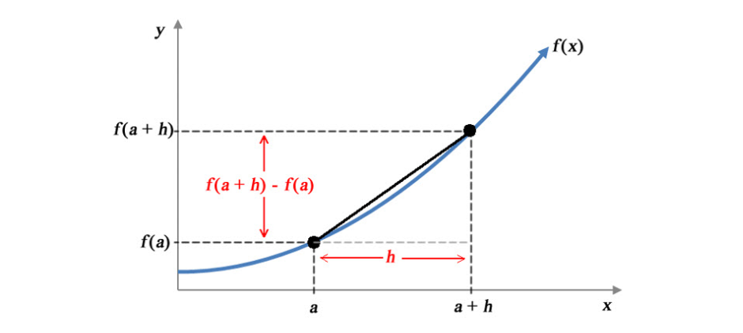

# Differentiation

**Aims**

- introduce the concept of differentiation and rules of differentiation

**Learning outcomes**

- to be able to explain differentiation in terms of rate of change and curve gradient
- to be able use differentiation rules to find derivatives in simple cases

## Rate of change
- We are often interested in the rate at which some variable is changing, e.g. we may be interested in the rate at which the temperature is changing or the rate of water levels increasing
- Rapid or unusual changes may indicate that we are dealing with unusual situations, e.g. global warming or a flood
- Rates of change can be positive, negative or zero corresponding to a variable increasing, decreasing and non-changing

```{r diff-rate, echo=F, fig.align='center', fig.height=4, fig.width=6, fig.cap = "The function $f(x)$ changes at different rates for different values of $x$"}

x <- seq(-10, 10, 0.1)
y <- (1*x^4 - 4*x^3 - x^2 - exp(-x))/1000

plot(x,y, type="l", ylab="f(x)", las = 1, panel.first = grid())

```

The function $f(x) = x^4 - 4x^3 - x^2 - e^{-x}$ changes at different rates for different values of $x$, e.g. 

- between $x \in (-10, -9)$ the $f(x)$ is increasing at slightly higher pace than $x \in (5,6)$ 
- between $x \in (-7, -5)$ the $f(x)$ is decreasing and
- between $x \in (0, 1)$ the $f(x)$ is not changing
- to be able to talk more precisely about the rate of change than just saying "large and positive" or "small and negative" change we need to quantify the changes, i.e. assign the rate of change an exact value
- **Differentiation** is a technique for calculating the rate of change of any function

## Average rate of change across an interval
```{r diff-01, echo=F, fig.align="center", fig.cap="The average rate of change of $f(x)$ with respect to $x$ over $[a, b]$ is equal to the slope of the secant line (in black)"}
knitr::include_graphics("figures/precourse/math-differentiation-01.png")

```

To divide further into calculating the rate of change let's look at Figure \@ref(fig:diff-01) and define the *average rate of change* of a function across an interval. Figure \@ref(fig:diff-01) shows a function $f(x)$ with two possible argument values $a$ and $b$ marked and their corresponding function values $f(a)$ and $f(b)$. 

Consider that $x$ is increasing from $a$ to $b$. The change in $x$ is $b-a$, i.e. as $x$ increases from $a$ to $b$ the function $f(x)$ increase from $f(a)$ to $f(b)$. The change in $f(x)$ is $f(b)-f(a)$ and the average rate of change of $y$ across the $[a,b]$ interval is: $$\frac{change\:in\:y}{change\:in\:x}=\frac{f(b)-f(a)}{b-a}$$ 

```{r diff-02, echo=F, fig.align="center", fig.cap="The average rate of change of $f(x)$ with respect to $x$ over $[a, b]$ is equal to the slope of the secant line (in black)"}


```


