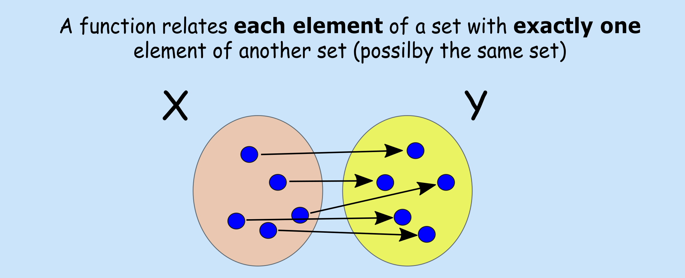

# Functions

**Aims**

- to revisit the concept of a function

**Learning outcomes**

- to be able to explain what function, function domain and function range are
- to be able to identify input, output, argument, independent variable, dependent variable
- to be able to evaluate function for a given value and plot the function

## Definitions

 
- A **function**, $f(x)$, can be viewed as a rule that relates input $x$ to an output $f(x)$
- In order for a rule to be a function it must produce a single output for any given input
- Input $x$ is also known as **argument** of the function
- **Domain of a function**: the set of all values that the function "maps"
- **Range**: the set of all values that the function maps into

 
**Many names used interchangeably** 

Functions have been around for a while and there are many alternative names and writing conventions are being used. Common terms worth knowing:

## Evaluating function
To evaluate a function is to replace (substitute) its variable with a given number or expression. E.g. given a rule (function) that maps temperature measurements from Celsius to Fahrenheit scale:
$$f(x) = 1.8x + 32$$
where $x$ is temperature measurements in Celsius and $f(x)$ is the associated value in Fahrenheit, we can find for a given temperature in Celsius corresponding temperature in Fahrenheit. Let's say we measure 10 Celsius degrees one autumn day in Uppsala and we want to share this information with a friend in USA. We can find the equivalent temperature in Fahrenheit by evaluating our function at 10, $f(10)$, giving us $$f(10) = 1.8\cdot 10 + 32 = 50$$

## Plotting function
Function graphs are a convenient way of showing functions, by looking at the graph it is easier to notice function's properties, e.g. for which input values functions yields positive outcomes or whether the function is increasing or decreasing. To graph a function, one can start by evaluating function at different values for the argument $x$ obtaining $f(x)$, plotting the points by plotting the pairs $(x, f(x))$ and connecting the dots. E.g. evaluating our above temperature rule at -20, -10, 0, 10, 20, 30 Celsius degrees results in: 

<!-- |x (Celsius degrees) | evaluates | f(x) (Farenheit degress)| -->
<!-- | :----------- | :----------- | :-------  |  -->
<!-- |-20 | $f(-20) = 1.8 \cdot (-20) + 32$| -4 | -->
<!-- |-10 | $f(-20) = 1.8 \cdot (-10) + 32$| 14 | -->
<!-- |0 | $f(-20) = 1.8 \cdot (0) + 32$| 32 | -->
<!-- |10 | $f(-20) = 1.8 \cdot (10) + 32$| 50 | -->
<!-- |20 | $f(-20) = 1.8 \cdot (20) + 32$| 68 | -->
<!-- |20 | $f(-20) = 1.8 \cdot (30) + 32$| 86 | -->

\begin{figure}

{\centering \includegraphics{103-math-functions_files/figure-latex/unnamed-chunk-2-1} 

}

\caption{Graph of f(x) for the temeprature rule}(\#fig:unnamed-chunk-2)
\end{figure}

## Standard classes of functions
**Algebraic function**: functions that can be expressed as the solution of a polynomial equation with integer coefficients, e.g. 

- constant function $f(x) = a$
- identity function $f(x) = x$
- linear function $f(x) = ax + b$
- quadratic function $f(x) = a + bx + cx^2$
- cubic function $fx() = a + bx + cx^2 + dx^3$

**Transcedental functions**: functions that are not algebraic, e.g. 

- exponential function $f(x) = e^x$
- logarithimic function $f(x) = log(x)$
- trigonometric function $f(x) = -3sin(2x)$

\begin{figure}

{\centering \includegraphics{103-math-functions_files/figure-latex/unnamed-chunk-3-1} 

}

\caption{Examples of the standard classess of functions}(\#fig:unnamed-chunk-3)
\end{figure}

## Piecewise functions
A function can be in pieces, i.e. we can create functions that behave differently based on the input $x$ value, e.g. 

\begin{equation}
    f(x) =
    \left\{
        \begin{array}{cc}
                2 & \mathrm{if\ } x \le 1 \\
                x & \mathrm{if\ } x>1 \\
        \end{array}
    \right.
\end{equation}

<!-- \begin{equation} -->
<!--     f(k;p) = -->
<!--     \left\{ -->
<!--         \begin{array}{cc} -->
<!--                 p & \mathrm{if\ } k \le 1 \\ -->
<!--                 1-p & \mathrm{if\ } k=0 \\ -->
<!--         \end{array} -->
<!--     \right. -->
<!-- \end{equation} -->

## Exercises: functions

\BeginKnitrBlock{exercise}
<strong>(\#exr:m-functions-01) </strong>  a = 1
\EndKnitrBlock{exercise}

## Answers to selected excercises (functions) {-}

Exr. \@ref(exr:m-functions-01)

